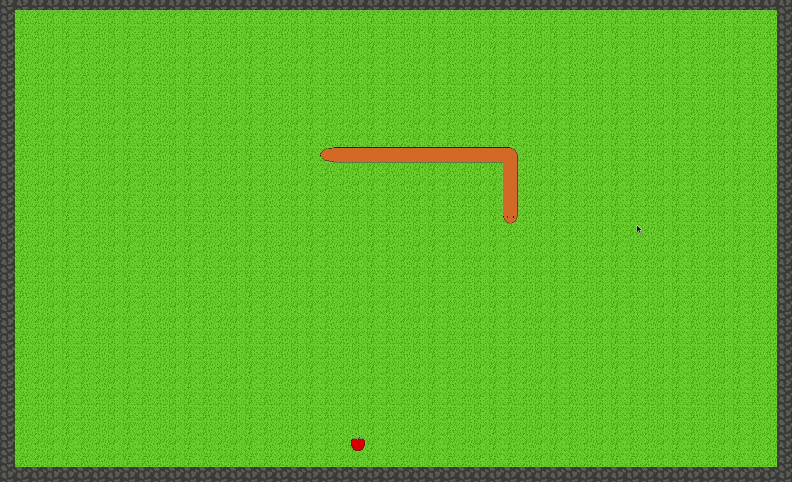

# Amethyst Snake
Snake game developed in Rust using the Amethyst game engine.

## States
### Snake
The main state in which the game runs. It transitions to GameOver if the snake hits itself or a wall.

### GameOver
Simple state that displays a "Game Over" text for two seconds before restarting the game.

## Resources
### AppleWasEaten
Contains a boolean indicating weather an apple was eaten on this frame. This is used for inter system communication.

### GameState
Tracks the game state so that systems can inform the state they are running in about wanted changes (i.e. when the snakes hits the wall, this is changed to `GameOver` so that the `SnakeGame` state can transition).

### NextDirection
As the input given to the snake will be used only when it moves, this stores the last input direction along with a `Stopwatch` tracking the time since the snake had last moved.

### SnakeSprites
Holds a vector to a sprite renderers, one per sprite, which are then accessed with `SnakeSpritesKeys`.

## Components
### AppleComponent
Tag that identifies an apple `Entity`.

### GamePositionComponent
A `glm::IVec2` (integer 2d vector) that is used to store the entity position within the board. The `Transform` is calculated from this value.

### SnakeHeadComponent
Tag that identifies which entity is the snake head.

### SnakePartComponent
Has an `Option<Entity>` that points to the next snake piece (it basically acts as a linked list).

## Systems
### AppleHandlerSystem
Checks if the snake is on the apple and, if so, moves the apple to an empty position and signals that the apple was eaten through the `AppleWasEaten` resource.

### InputSystem
Updates the `NextDirection` resource whenever an action is pressed.

### MoveSnakeComponent
Each 200ms, it moves the snake towards `NextDirection`.

### SnakeCollisionComponent
Checks that the snake did not hit itself or a wall.

### SnakeRendererComponent
Updates the sprites of each `Entity` with `SnakePartComponent` based on the `GamePositionComponent` relative to the previous and the following `Entity` with `SnakePartComponent`.

### TransformPositionComponent
Updates each `Entity` `Transform` component based on the `GamePositionComponent`.